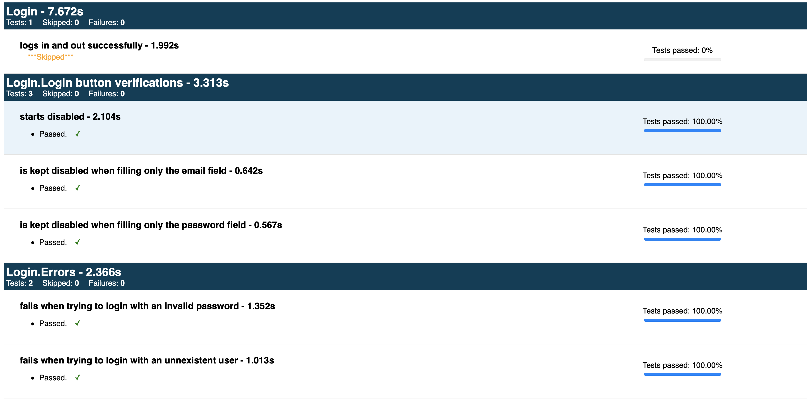

# Lesson 13 - HTML test report

After running automated tests, we can automatically make artifacts available for consumption by stakeholders.

Some of these stakeholders will prefer to look into a web page for the tests' results than to a terminal. Also, when tests are failing, they might want to see a screenshot of the page under test during the failure so that it can be easier to understand what happened.

Meet [protractor-jasmine2-html-reporter](https://www.npmjs.com/package/protractor-jasmine2-html-reporter).

> From the docs: "HTML reporter for Jasmine2 and Protractor that will include screenshots of each test if you want."

And it's also easy to implement it. See below.

```js
module.exports.config = {
  // rest of the code ...
  onPrepare: () => {
    // rest of the code ...
    jasmine.getEnv().addReporter(new Jasmine2HtmlReporter({
      savePath: 'assets/test-report',
      fileName: 'index',
      fixedScreenshotName: true,
      cleanDestination: true,
      consolidate: true,
      takeScreenshotsOnlyOnFailures: true,
    }))
  }
}
```

With the above configuration, we will have a test report saved at `assets/test-report/index.html`, it will clean the `assets/test-report/` directory on every test run, it'll consolidate all test results into a single file, and if tests fail, it will take screenshots and make them available in the HTML report.

It's your turn.

## Exercise

1. Install `protractor-jasmine2-html-reporter` as a dev dependency
2. Configure Protractor to use it

If you've done it right, you should see a report like this after running the tests.

> 🕵🏻‍♀️ You will have to manually open the `assets/test-report/index.html` file on your preferred web browser.



> Note: the first test is shown as skipped because there's no explicit assertion on it (e.g., `expect(page.yourNotesHeading.isDisplayed()).toBe(true)`). Instead, we have an implicit expectation with the help of `protractor-helper` (e.g., `helper.waitForElementVisibility(page.yourNotesHeading)`.)

> For more details on the above note, read https://github.com/wlsf82/protractor-helper#using-methods-that-start-with-wait-as-test-expectations-or-test-assertions.

> 🕵🏻‍♀️ And if there were a test failure, a screenshot would be shown in the report. 😉

___

So, let's create some tests for another feature?

Move on to [lesson 14](./14.md) to test CRUD operations.
